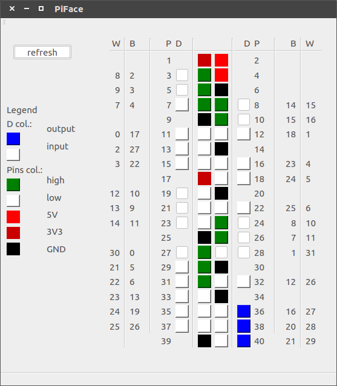

# PiFace
## Grafikus kezelőfelület a [wiringPi](http://wiringpi.com/) software-könyvtárhoz.



## Figyelmeztetés:
Az alkalmazás nagyon korai állapotban van, a készítő semmilyen felelősséget nem vállal az esetleges hadware-ben vagy software-ben keletkező, az alkalmazás használatából eredő károkért!

## Előkövetelmények:
A kezelőfelület indítása előtt bizonyosodjunk meg róla, hogy a Raspberry Pi-n fut a [szerver alkalmazás](https://github.com/kristofkalocsai/PiFaceServer). Ha ez eddig nem történt meg, tegyük a következőket:
+ hozzunk létre helyi [hálózati kapcsolatot](https://www.raspberrypi.org/documentation/configuration/wireless/wireless-cli.md) a Pi és a számítógép (amelyen a grafikus klienst futtatnánk, lehet maga a Pi is, ekkor a kapcsolatot nem kell létrehozni) között.
+ [tárcsázzunk be](https://www.raspberrypi.org/documentation/remote-access/ssh/) a Pi-re.
+ indítsuk el a szerveroldali alkalmazást a Pi-n (ne felejtsük rendszergazdai jogokkal indítani, erre mindenképpen figyelmeztet a program is)
+ ekkor a következő üzenetet kapjuk:
```shell
$ sudo ./piproj
initializing wiringPi...
opening socket
binding socket
listening...
```
+ most indíthatjuk a grafikus felületet a PC-n
+ sikeres csatlakozás esetén a szerver tájékoztat a kapcsolat létrejöttéről:
```shell
INCOMING CONNECTION
ASSIGNING 1. PLACE TO CLIENT 5
reading all pins
```
+ ekkor elindíthatjuk a grafikus kezelőfelületet.


## Grafikus felület:
+ Az ablak bal oldalán látható a jelmagyarázat, amely a gombokhoz rendelt funkciók lehetséges állapotait mutatják.

  + A funkcióválasztó gombok kék színűek, ha az adott láb kimenet, fehérek ha bemenet.

  + A jelszintválasztó gombok zöld színűek, ha a kimenet magas állapotú, fehérek ha alacsony.

  + Amely gombok piros-vörös-fekete színűek, azok tápfeszültség lábak a csatlakozón, ezeket nem tudjuk állítani.

+ A bal felső sarokban található **refresh** gombra kattintva lehet aktualizálni a kezelőfelület megjelenését.

  + A módosítások (vagy külső megváltozások) csak ekkor jelennek meg a gombokon.

+ A középső részen található négy gomb-oszlop a Raspberry Pi lábkiosztását hivatott ábrázolni.

  + A két külső oszlop (**D** betűvel jelölve az első sorban) a pin-ek funcióját (kimenet-bemenet) jeleníti meg, illetve rákattintva azok megváltoztathatóak.

  + A középső két gomb-oszlop a lábak jelszintjét szimbolizálja, illetve ezekre kattintva az átbillenthető (high-low).

+ A pin-eket szimbolizáló gombokkal egy sorban, mindkét oldalon számok láthatók. Ezek a lábak különböző megnevezéseit hordozzák.
  + A **P** -vel jelölt oszlopban a 40 pólusú GPIO csatlakozó fizikai lábkiosztása szerepel.

  + A **B** jelű oszlopban a BroadCom belső GPIO számozása található.

  + A **W** jelű oszlopban a wiringPi által használt GPIO számozás szerepel.

## Használat:
Ebben a korai verzióban a grafikus felületen végzett módosítások csak az eszközön érvényesülnek azonnal, a megjelenítő felületek frissítéséhez használjuk a **refresh** gombot.

A funkcióválasztó gombokkal állítsuk a kívánt működésűre az adott lábat.

A jelszintválasztó gombokkal állítsuk be a kimenet értékét.

A használat befejeztével zárjuk be az alkalmazást a szokott módon. Ekkor a szerver bontja a kapcsolatot, és várja az újabb csatlakozást.
